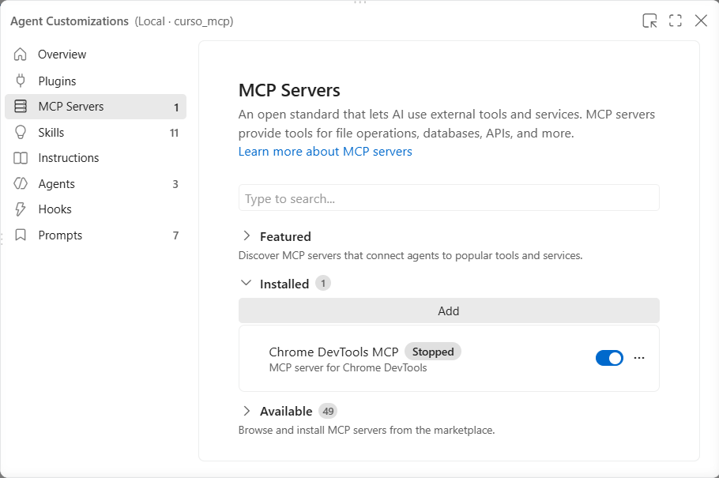
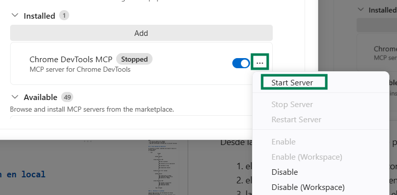

# Depuración aplicaciones con Chrome DevTools MCP

---

## Índice

- [1. Objetivo](#1-objetivo)
- [2. ¿Qué es Chrome DevTools MCP?](#2-qué-es-chrome-devtools-mcp)
- [3. Requisitos previos](#3-requisitos-previos)
- [4. Configurar Chrome DevTools MCP en VS Code](#4-configurar-chrome-devtools-mcp-en-vs-code)
  - [4.1. Configuración para el proyecto o workspace](#41-configuración-para-el-proyecto-o-workspace)
  - [4.2. Configuración de `mcp.json`](#42-configuración-de-mcpjson)
  - [4.3. Comprobar el servidor MCP](#43-comprobar-el-servidor-mcp)
- [5. Ejecutar la aplicación en local](#5-ejecutar-la-aplicación-en-local)
- [6. Utilizar Chrome DevTools MCP desde GitHub Copilot](#6-utilizar-chrome-devtools-mcp-desde-github-copilot)
- [7. Prompt para realizar la depuración](#7-prompt-para-realizar-la-depuración)
- [8. Flujo esperado de depuración](#8-flujo-esperado-de-depuración)
  - [8.1. Reproducir el problema](#81-reproducir-el-problema)
  - [8.2. Inspeccionar la consola](#82-inspeccionar-la-consola)
  - [8.3. Relacionar el error con el workspace](#83-relacionar-el-error-con-el-workspace)
  - [8.4. Corregir el código](#84-corregir-el-código)
- [9. Verificar la solución utilizando Chrome DevTools MCP](#9-verificar-la-solución-utilizando-chrome-devtools-mcp)
- [10. ¿Qué aporta Chrome DevTools MCP?](#10-qué-aporta-chrome-devtools-mcp)
- [11. Opcional: utilizar una instancia de Chrome existente](#11-opcional-utilizar-una-instancia-de-chrome-existente)
- [12. Conclusión](#12-conclusión)

---

## 1. Objetivo

En este ejemplo vamos a utilizar **GitHub Copilot dentro de Visual
Studio Code**, ejecutándose localmente, junto con el MCP **Chrome DevTools
MCP** para investigar y corregir un bug de una aplicación web que ya
existe en el workspace.

El objetivo no es que Copilot encuentre el problema únicamente revisando
el código fuente. Queremos utilizar Chrome DevTools MCP para:
- Reproducir el error en una instancia real de Chrome
- Obtener evidencias del problema en tiempo de ejecución 
- Corregir el código. 
- Volver a utilizar el navegador para verificar la solución.

La arquitectura del ejemplo es:

``` text
┌──────────────────────── VS Code ───────────────────────┐
│                                                        │
│  Proyecto o Workspace              GitHub Copilot      │
│  ├── código de la aplicación             │             │
│  └── .vscode/mcp.json                    │ MCP         │
│                                          ▼             │
│                                Chrome DevTools MCP     │
└──────────────────────────────────────────┬─────────────┘
                                           │
                                           ▼
                                        Chrome
                                           │
                                           ▼
                                      localhost
                                           │
                                           ▼
                                  Aplicación web local
```

Mientras que GitHub Copilot puede leer y modificar los archivos del código fuente. Chrome
DevTools MCP, por su parte, proporciona al agente acceso a un navegador Chrome real en ejecución y la información de sus DevTools.

## 2. ¿Qué es Chrome DevTools MCP?

**Chrome DevTools MCP** es un servidor [Model Context Protocol
(MCP)](https://modelcontextprotocol.io/) que permite a agentes de
programación interactuar con Chrome y utilizar capacidades de Chrome
DevTools.

Entre otras operaciones, permite:

-   abrir y navegar por páginas web;
-   interactuar con los elementos de una página;
-   introducir datos y realizar clics;
-   inspeccionar mensajes y errores de la consola;
-   consultar información de las peticiones de red;
-   obtener información de la página y realizar capturas;
-   trabajar con información de rendimiento de Chrome.

En nuestro ejemplo utilizaremos principalmente la **interacción con la
página** y la **consola JavaScript** para reproducir y diagnosticar un
bug.

> **Nota de seguridad:** el cliente MCP puede acceder a información
> disponible en la instancia de Chrome que controla. Para una
> demostración como ésta conviene utilizar la instancia de navegador
> dedicada que utiliza Chrome DevTools MCP y no introducir información
> sensible.

Documentación oficial:

-   [Chrome DevTools
    MCP](https://github.com/ChromeDevTools/chrome-devtools-mcp)
-   [Configuración de
    clientes](https://github.com/ChromeDevTools/chrome-devtools-mcp/blob/main/docs/client-configurations.md)
-   [Servidores MCP en Visual Studio
    Code](https://code.visualstudio.com/docs/copilot/chat/mcp-servers)

## 3. Requisitos previos

Para realizar el ejemplo necesitamos:

-   **Visual Studio Code**.
-   **GitHub Copilot** habilitado en VS Code.
-   **Google Chrome** instalado.
-   **Node.js y npm**, ya que utilizaremos `npx` para ejecutar Chrome
    DevTools MCP.
-   La aplicación web del ejemplo disponible en el workspace.
-   La aplicación preparada para ejecutarse en `localhost`.

Podemos comprobar Node.js, npm y npx desde el terminal integrado de VS
Code:

``` bash
node --version
npm --version
npx --version
```

No es necesario instalar `chrome-devtools-mcp` globalmente.

## 4. Configurar Chrome DevTools MCP en VS Code

### 4.1. Configuración para el proyecto o workspace

Para este ejemplo se configurará el proyecto para ser **cliente** del MCP **Chrome DevTools MCP** para el **proyecto**.

Crearemos el archivo:

``` text
.vscode/mcp.json
```

De esta manera, indicamos al proyecto cómo acceder al servidor MCP:

``` text
curso_mcp/
├── .vscode/
│   └── mcp.json
├── ...
└── código de la aplicación
```

### 4.2. Configuración de `mcp.json`

Añadimos la siguiente configuración:

``` json
{
  "servers": {
    "chrome-devtools": {
      "type": "stdio",
      "command": "npx",
      "args": [
        "-y",
        "chrome-devtools-mcp@latest"
      ]
    }
  }
}
```

La parte importante es:

``` text
npx -y chrome-devtools-mcp@latest
```

`npx` descarga y ejecuta el paquete cuando es necesario, por lo que no
necesitamos realizar una instalación global.

Con esta configuración el flujo será:

``` text
GitHub Copilot
       │
       │ MCP
       ▼
chrome-devtools-mcp
       │
       ▼
     Chrome
```

### 4.3. Comprobar el servidor MCP

Una vez guardado `.vscode/mcp.json`, VS Code debe detectar el servidor
`chrome-devtools`.



Desde las funcionalidades MCP de VS Code podemos comprobar que:
1.  el servidor `chrome-devtools` está configurado;
2.  el servidor puede iniciarse correctamente;
3.  las herramientas proporcionadas por el MCP están disponibles para
    GitHub Copilot.



La interfaz exacta puede variar según la versión de VS Code, pero el
objetivo es confirmar que Copilot dispone de las herramientas de Chrome
DevTools antes de iniciar la depuración.

> Si VS Code solicita autorización para iniciar o utilizar el servidor
> MCP, debemos revisar la configuración y aceptar su ejecución para este
> workspace.

## 5. Ejecutar la aplicación en local

Antes de pedir a Copilot que investigue el problema, arrancamos nuestra
aplicación desde el terminal integrado de VS Code utilizando el comando
correspondiente al proyecto.

Por ejemplo:

``` bash
npm start
```

La aplicación deberá quedar accesible mediante una URL local, por
ejemplo:

``` text
http://localhost:3000
```

> Sustituir `http://localhost:3000` por la URL y puerto reales
> utilizados por la aplicación del ejemplo.

No necesitamos abrir manualmente Chrome para realizar la demostración
básica. Chrome DevTools MCP puede iniciar/controlar una instancia de
Chrome cuando Copilot comienza a utilizar sus herramientas.

## 6. Utilizar Chrome DevTools MCP desde GitHub Copilot

Abrimos **GitHub Copilot Chat** en VS Code y utilizamos su modo de
agente, asegurándonos de que las herramientas proporcionadas por
`chrome-devtools` están disponibles.

El objetivo es que Copilot pueda combinar dos tipos de capacidades:

``` text
Proyecto
   │
   ├── leer código
   └── modificar código

Chrome DevTools MCP
   │
   ├── abrir localhost
   ├── interactuar con la aplicación
   ├── reproducir el bug
   └── inspeccionar Chrome DevTools
```

Es importante que el prompt fuerce al agente a **reproducir primero el
problema en Chrome**. De lo contrario, Copilot podría detectar el bug
mediante una simple revisión estática del código y el ejemplo no
demostraría realmente el valor de Chrome DevTools MCP.

## 7. Prompt para realizar la depuración

Podemos utilizar el siguiente prompt como punto de partida.

> Debemos sustituir la URL y los pasos de interacción por los
> correspondientes a nuestra aplicación.

``` text
La aplicación de este proyecto está ejecutándose localmente en:

http://localhost:3000

Utiliza Chrome DevTools MCP para investigar y corregir el problema
que presenta la aplicación.

IMPORTANTE:

No analices inicialmente el código fuente para intentar deducir el
problema. Antes de modificar ningún archivo debes reproducir el fallo
y obtener evidencias del error utilizando Chrome DevTools MCP.

Realiza los siguientes pasos:

1. Utiliza Chrome DevTools MCP para abrir:

   http://localhost:3000

2. Interactúa con la aplicación para reproducir el problema.

   Realiza exactamente las siguientes acciones:
   - Introduce el valor `340` en el campo de entrada «Precio (€)».
   - Introduce el valor `20` en el campo de entrada «Descuento (%)».
   - Haz clic en el botón «Calcular».
   - Se debería mostrar el precio total con el descuento aplicado con el formato: `Precio final: 272 €`.

3. Observa el comportamiento de la aplicación.

4. Utiliza Chrome DevTools MCP para inspeccionar los mensajes y errores de la consola de Chrome y cualquier otra información del navegador que pueda ayudar a diagnosticar el problema.

5. Una vez reproducido el problema y obtenida evidencia mediante Chrome DevTools MCP, analiza el código fuente del workspace.

6. Relaciona el error observado en Chrome con el código fuente e identifica su causa.

7. Modifica únicamente el código necesario para corregir el problema.

8. Utiliza nuevamente Chrome DevTools MCP para recargar la aplicación.

9. Repite exactamente las mismas acciones utilizadas anteriormente para reproducir el problema.

10. Comprueba mediante Chrome DevTools MCP que:

    - el comportamiento de la aplicación ahora es correcto;
    - el error original ya no aparece;
    - no se han producido nuevos errores JavaScript en la consola.

Finalmente, resume:

- qué problema has encontrado;
- qué evidencia has obtenido mediante Chrome DevTools MCP;
- cuál era la causa en el código;
- qué modificación has realizado;
- cómo has verificado en Chrome que la solución funciona.
```

## 8. Flujo esperado de depuración

Al ejecutar el prompt, esperamos que Copilot realice un proceso similar
al siguiente:

``` text
                  Prompt
                    │
                    ▼
             GitHub Copilot
                    │
                    ▼
          Chrome DevTools MCP
                    │
                    ├── abre localhost
                    │
                    ├── interactúa con la aplicación
                    │
                    ├── reproduce el bug
                    │
                    └── inspecciona Console
                    │
                    ▼
          Evidencia del error runtime
                    │
                    ▼
             GitHub Copilot
                    │
                    ├── inspecciona el código
                    ├── relaciona código y error
                    └── modifica el código
                    │
                    ▼
          Chrome DevTools MCP
                    │
                    ├── recarga la aplicación
                    ├── repite la prueba
                    └── comprueba Console
                    │
                    ▼
              Bug corregido
```

### 8.1. Reproducir el problema

Copilot debe utilizar las herramientas de Chrome DevTools MCP para abrir
la aplicación y ejecutar las acciones indicadas en el prompt.

La primera evidencia debe proceder del comportamiento real de la
aplicación, no exclusivamente de una lectura del código.

### 8.2. Inspeccionar la consola

Después de reproducir el problema, Copilot puede consultar los mensajes
de la consola de Chrome.

Si el bug produce una excepción JavaScript, la consola puede
proporcionar información como:

``` text
TypeError: ...
```

junto con información que permita relacionar el error con el código que
se está ejecutando.

### 8.3. Relacionar el error con el workspace

Una vez obtenida la evidencia en runtime, Copilot puede inspeccionar los
archivos del workspace.

En este momento el agente dispone de dos fuentes de información:

``` text
Chrome
   └── evidencia del error en ejecución

Proyecto
   └── código que provoca ese comportamiento
```

Esto permite realizar un diagnóstico basado en el comportamiento real de
la aplicación.

### 8.4. Corregir el código

Copilot modificará únicamente los archivos necesarios para solucionar el
problema identificado.

El proceso **no debe finalizar en este punto**.

La modificación del código es una hipótesis de solución que todavía debe
comprobarse en el navegador.

## 9. Verificar la solución utilizando Chrome DevTools MCP

Después de modificar el código, Copilot debe volver a utilizar Chrome
DevTools MCP.

El ciclo completo que queremos demostrar es:

``` text
Reproducir
    │
    ▼
Observar
    │
    ▼
Diagnosticar
    │
    ▼
Modificar
    │
    ▼
Recargar
    │
    ▼
Repetir la prueba
    │
    ▼
Verificar
```

Copilot debe:

1.  recargar la aplicación en Chrome;
2.  repetir las mismas acciones que producían el bug;
3.  comprobar que ahora se obtiene el resultado esperado;
4.  volver a inspeccionar la consola;
5.  verificar que el error original ha desaparecido y que la corrección
    no ha provocado nuevos errores.

Este último paso es importante porque demuestra una de las ventajas
principales de utilizar Chrome DevTools MCP: el agente no se limita a
**proponer una corrección**, sino que puede **comprobarla en la
aplicación real**.

## 10. ¿Qué aporta Chrome DevTools MCP?

Sin Chrome DevTools MCP podríamos pedir simplemente:

``` text
Revisa el código de este proyecto y corrige el bug.
```

En el escenario sin Chrome DevTools MCP, Copilot realizaría principalmente un análisis estático:

``` text
Código
  │
  ▼
Copilot
  │
  ▼
Posible corrección
```

Con Chrome DevTools MCP podemos realizar un flujo diferente:

``` text
Aplicación real
      │
      ▼
Chrome / DevTools
      │
      ▼
Evidencia runtime
      │
      ▼
Copilot
      │
      ├── analiza el código
      └── realiza la corrección
              │
              ▼
            Chrome
              │
              ▼
      Verificación real
```

Por tanto, Chrome DevTools MCP permite incorporar al flujo del agente
información que normalmente obtendríamos manualmente abriendo las
herramientas de desarrollo del navegador.

## 11. Opcional: utilizar una instancia de Chrome existente

Para este primer ejemplo no es necesario configurar Chrome manualmente
ni utilizar un puerto de remote debugging.

Chrome DevTools MCP también ofrece opciones avanzadas para conectarse a
una instancia de Chrome existente, por ejemplo mediante opciones como
`--browser-url` o mecanismos de conexión automática compatibles con
determinadas versiones de Chrome.

Estas posibilidades son útiles cuando queremos trabajar con una
instancia concreta del navegador, pero añaden conceptos adicionales
---remote debugging, perfiles y configuración del navegador--- que no
son necesarios para demostrar el flujo básico.

Para este ejemplo utilizaremos por tanto el escenario más sencillo:

``` text
VS Code / Copilot
       │
       ▼
Chrome DevTools MCP
       │
       ▼
Chrome gestionado por el MCP
       │
       ▼
Aplicación en localhost
```

## 12. Conclusión

En este ejemplo hemos integrado Chrome DevTools MCP con GitHub Copilot
dentro de VS Code para proporcionar al agente acceso al comportamiento
real de una aplicación web ejecutándose localmente.

El aspecto más importante del ejemplo no es únicamente que Copilot pueda
corregir el código, sino el ciclo completo:

``` text
reproducir → observar → diagnosticar → corregir → verificar
```

Chrome DevTools MCP proporciona la parte de **observación y verificación
en el navegador**, mientras que GitHub Copilot puede relacionar esa
información con el código del workspace y realizar las modificaciones
necesarias.

De esta manera, el navegador y Chrome DevTools pasan a formar parte de
las herramientas que el agente puede utilizar durante una sesión de
depuración.
