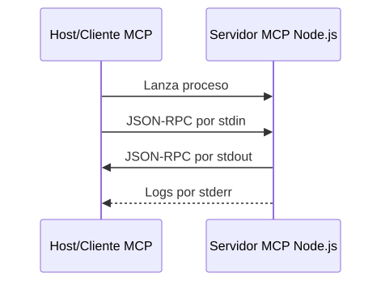

<style>
header {
  text-align: right;
  color: black;
}
</style>

# Model Context Protocol (MCP)
<!-- paginate: skip -->

Formador: Vladimir Bataller

---
<!-- _paginate: skip -->
# Índice


- [1. Agenda](#4)
- [2. Introducción](#5)
- [3. Consumo de MCPs existentes](#30)
- [4. Creación de un MCP propio con Node.js](#31)
- [5. Transportes MCP: stdio vs Streamable HTTP](#55)
- [6. Seguridad y operación básica](#73)
- [7. Glosario](#89)
- [8. Resumen para recordar](#94)

---
- [9. Referencias oficiales](#96)

---

## 1. Agenda
<!-- header: "1. Agenda"-->

| Bloque | Duración | Contenido |
|---|---|---|
| 1 | 45 min | Introducción y ejemplo de uso de un MCP|
| 3 | 75 min | Creación de un MCP propio con Node.js |

---

<!-- paginate: true -->
# 2. Introducción
<!-- header: "2. Introducción"-->

- [2.1. Ejemplos de este curso](#6)
- [2.2. Definición](#7)
- [2.3. Problema que resuelve MCP](#8)
- [2.4. Arquitectura básica](#12)
- [2.5. Capas del protocolo MCP](#17)
- [2.6. Primitivas principales](#21)
- [2.7. Matriz de decisión rápida](#28)

---
## 2.1. Ejemplos de este curso

Los ejemplos de este curso corresponden a tres repositorios que se pueden clonar con los siguientes comandos:

```bash
git clone https://github.com/vladimirbat/curso_mcp.git
git clone https://github.com/vladimirbat/curso_mcp_server.git
git clone https://github.com/vladimirbat/web_peliculas.git
```

Se recomienda descargarlos todos en la misma carpeta contenedora y crear un espacio de trabajo de Visual Studio Code que importe las tres carpetas de los proyectos.

---

## 2.2. Definición

Model Context Protocol, o MCP, es un protocolo abierto que permite conectar aplicaciones de IA con datos, herramientas y sistemas externos de forma estandarizada.


---
## 2.3. Problema que resuelve MCP
<!-- header: "2.3. Problema que resuelve MCP"-->

- El asistente no tiene acceso directo al contexto real del proyecto.
- El usuario copia y pega archivos, tickets, documentación o errores manualmente.
- Cada herramienta tiene una integración distinta.
- El modelo puede necesitar muchas iteraciones para obtener información suficiente.
- No siempre queda claro qué acciones ha ejecutado la IA y con qué permisos.

---

MCP busca resolver estos problemas mediante un protocolo común para conectar aplicaciones de IA con herramientas y fuentes de contexto externas. 

---

Ejemplos de posibles MCP:

- Archivos de un proyecto.
- Documentación interna.
- Tickets de Jira, GitHub Issues o GitLab Issues.
- Repositorios de código.
- Diseños de Figma.
- Sistemas de CI/CD.
- APIs internas y bases de datos.
- Generadores de pruebas.
- Catálogos de componentes UI.

---
Qué MCP he usado:

- Chrome dev tools
- Kubernetes mcp (OpenShift)
- Figma
- Atlassian (JIRA)
- XRay
- mongo
- postgresql

---
## 2.4. Arquitectura básica

MCP sigue una arquitectura cliente-servidor.



---
### 2.4.1. Host

El **host** es la aplicación de IA que usa el usuario. Puede ser un IDE, una aplicación de escritorio, una interfaz de chat o una herramienta de agente. Ejemplos de host:

- Un IDE con capacidades de IA.
- Claude Desktop.
- Un cliente personalizado creado por una empresa.
- Una herramienta interna de automatización con LLM.

El host coordina la conversación con el modelo LLM y decide qué servidores MCP están disponibles.

---
### 2.4.2. Cliente MCP

El **cliente MCP** es el componente que mantiene una conexión con un servidor MCP concreto. Normalmente vive dentro del host.

Si un host se conecta a tres servidores MCP, normalmente tendrá tres clientes MCP, uno por servidor.

---

Responsabilidades habituales del cliente MCP:

- Inicializar la conexión.
- Descubrir capacidades del servidor.
- Listar tools, resources y prompts.
- Invocar tools.
- Leer resources.
- Recuperar prompts.
- Gestionar errores y logs.
- Solicitar confirmaciones de usuario cuando proceda.

---
### 2.4.3. Servidor MCP

El **servidor MCP** es el programa o servicio que expone capacidades al cliente. Puede ejecutarse:

- Localmente, como un proceso iniciado por el cliente.
- Remotamente, como un servicio HTTP desplegado en una infraestructura compartida.

Un servidor MCP no es necesariamente un servidor web. Un servidor local sobre `stdio` puede ser simplemente un proceso Node.js que lee mensajes por `stdin` y responde por `stdout`.

---
## 2.5. Capas del protocolo MCP

MCP puede entenderse en dos capas:
- Capa de datos.
- Capa de transporte.

---
### 2.5.1. Capa de datos

Define los mensajes y operaciones basados en JSON-RPC 2.0. Aquí aparecen conceptos como:

- Inicialización.
- Capacidades.
- Requests.
- Responses.
- Notifications.
- Tools.

---
- Resources.
- Prompts.

---
### 2.5.2. Capa de transporte

Define cómo viajan esos mensajes entre cliente y servidor. Los transportes estándar actuales son:

- `stdio`.
- `Streamable HTTP`.

Un servidor MCP no es simplemente una API REST. Puede usar HTTP, pero sus mensajes siguen el modelo JSON-RPC definido por MCP.

---
## 2.6. Primitivas principales
<!-- header: "2.6. Primitivas principales"-->

MCP define varias primitivas. Las más importantes son:
- Tools.
- Resources.
- Prompts.

---
### 2.6.1. Tools

Las **tools** son funciones que el modelo puede solicitar ejecutar, normalmente con aprobación o supervisión del usuario.

Ejemplos:

```text
search_tickets(projectKey, status)
create_branch(issueId)
get_component_docs(componentName)
run_unit_tests(packageName)
query_database(sql)
```

Se llamará a una tool para que el MCP realice acciones, cálculos, búsquedas o interacciones con sistemas externos.

---
Características clave:

- Tienen nombre único.
- Tienen descripción.
- Declaran un schema de entrada.
- Pueden devolver texto, contenido estructurado, imágenes, audio o referencias a resources.
- Pueden fallar de forma recuperable usando el atributo  `isError: true`.

---
### 2.6.2. Resources

Los **resources** son datos o documentos que el cliente puede leer para aportar contexto al modelo.

Ejemplos:

```text
file:///project/README.md
docs://frontend/design-system
schema://database/public
figma://component/Button
```

Usa un resource cuando quieras exponer información consultable sin que su lectura implique una acción pesada o peligrosa.

---
Características clave:

- Se identifican mediante una URI.
- Pueden representar texto o datos binarios.
- Pueden estar parametrizados mediante plantillas de URI.
- Son útiles para documentación, configuración, esquemas, catálogos y archivos.

---
### 2.6.3. Prompts

Los **prompts** son plantillas reutilizables de mensajes que el servidor pone a disposición del cliente o del usuario.

Ejemplos:

```text
review_code(code)
generate_test_plan(userStory)
summarize_incident(logs)
create_accessibility_report(componentName)
```

Usa un prompt cuando quieras estandarizar una interacción con el modelo.

---

Características clave:

- Son normalmente seleccionados por el usuario.
- Pueden aceptar argumentos.
- Devuelven una secuencia de mensajes preparada para el modelo.
- Ayudan a homogeneizar prácticas dentro de un equipo.

---
## 2.7. Matriz de decisión rápida
<!-- header: "2.7. Matriz de decisión rápida"-->

| Necesidad | Primitiva | Ejemplo |
|---|---|---|
| Ejecutar una acción | Tool | Crear rama, consultar API, lanzar tests |
| Leer contexto | Resource | README, schema de DB, documentación UX |
| Estandarizar una instrucción | Prompt | Revisión de código, plan de pruebas |
| Devolver un resultado grande | Resource o resource_link | Resultado de análisis, archivo generado |

--- 

| Necesidad | Primitiva | Ejemplo |
|---|---|---|
| Pedir confirmación antes de modificar algo | Tool con aprobación del cliente | Borrar archivo, crear issue, desplegar |

---
# 3. Consumo de MCPs existentes
<!-- header: "3. Consumo de MCPs existentes"-->

Para ver cómo emplear un MCP existente, se va a realizar un ejempolo con el **Chrome DevTools MCP**. Los pasos a seguir se pueden ver en el documento:

 [PRACTICA_USO_MCP_EXISTENTE.md](./PRACTICA_USO_MCP_EXISTENTE.md)

---
# 4. Creación de un MCP propio con Node.js
<!-- header: "4. Creación de un MCP propio con Node.js"-->

- [4.1. Qué vamos a construir](#33)
- [4.2. Estructura del proyecto](#35)
- [4.3. Crear el proyecto e instalar dependencias](#36)
- [4.4. Configurar package.json](#38)
- [4.5. Conexión con TMDB y credenciales](#39)
- [4.6. Crear el servidor MCP](#41)
- [4.7. Registrar tools en el servidor](#43)

---
- [4.8. Anatomía de una tool MCP](#44)
- [4.9. Manejo de errores y disciplina stdio](#46)
- [4.10. Probar con MCP Inspector](#48)
- [4.11. Conectar el servidor en VS Code](#50)
- [4.12. Buenas prácticas para diseñar tools](#52)
- [4.13. Práctica de uso del servidor MCP desde otra aplicación](#53)

---

## 4.1. Qué vamos a construir
<!-- header: "4.1. Qué vamos a construir"-->

Construiremos un servidor MCP local en **JavaScript y Node.js** que se conecta a la API de **TMDB** (The Movie Database).

Expone dos tools principales:

1. `get_actor_movies`: busca un actor o actriz y devuelve las películas en las que ha participado.
2. `get_movie_cast`: busca una película y devuelve su reparto de actores.

---

El servidor simplifica la interacción para el modelo:
- Oculta URLs, endpoints REST y autenticación de TMDB.
- Recibe parámetros sencillos en lenguaje natural.
- Devuelve datos limpios y estructurados.

---

## 4.2. Estructura del proyecto
<!-- header: "4.2. Estructura del proyecto"-->

Un proyecto de servidor MCP sencillo en Node.js organizado por responsabilidades:

```text
tmdb-mcp-server/
├── package.json          # Metadatos, dependencias y scripts
├── .env.example          # Plantilla de variables de entorno
└── src/
    ├── index.js          # Servidor MCP, registro de tools e inicio stdio
    ├── tmdb.js           # Consultas HTTP a la API REST de TMDB
    └── errors.js         # Tipos de errores personalizados
```

---

## 4.3. Crear el proyecto e instalar dependencias
<!-- header: "4.3. Crear el proyecto e instalar dependencias"-->

Creamos el directorio e instalamos los paquetes necesarios:

```powershell
mkdir tmdb-mcp-server
cd tmdb-mcp-server
npm init -y
npm install @modelcontextprotocol/server zod
```
---
Ventajas de este enfoque:
- **Sin compilador**: ejecutamos JavaScript moderno directamente con Node.js `>=20`.
- **`@modelcontextprotocol/server`**: SDK oficial para crear servidores MCP y gestionar el transporte `stdio`.
- **`zod`**: definición y validación de esquemas de entrada para las tools.

---

## 4.4. Configurar package.json
<!-- header: "4.4. Configurar package.json"-->


```json
{
  "name": "tmdb-mcp-server", "version": "1.0.0",
  "type": "module", "main": "src/index.js",
  "scripts": {
    "start": "node src/index.js"
  },
  "dependencies": {
    "@modelcontextprotocol/server": "^2.0.0",
    "zod": "^4.0.0"
  }
}
```

Al incluir `"type": "module"`, podemos usar `import`/`export` de forma nativa.

---

## 4.5. Conexión con TMDB y credenciales
<!-- header: "4.5. Conexión con TMDB y credenciales"-->

En `src/tmdb.js` encapsulamos las llamadas a la API de TMDB:

- **Lectura de la API Key**: se obtiene de las variables de entorno del proceso:
  ```javascript
  function getApiKey() {
    const apiKey = process.env.TMDB_API_KEY;
    if (!apiKey) {
      throw new ConfigurationError("TMDB_API_KEY no está configurada.");
    }
    return apiKey;
  }
  ```
---  
  
- **Peticiones HTTP**: usamos `fetch` nativo de Node.js.
- **Funciones de negocio exportadas**:
  - `getActorMovies({ actor, language, limit })`
  - `getMovieCast({ movie, year, language, limit })`

---

## 4.6. Crear el servidor MCP
<!-- header: "4.6. Crear el servidor MCP"-->

En `src/index.js` inicializamos la instancia de `McpServer`:

```javascript
import { McpServer } from "@modelcontextprotocol/server";
import { serveStdio } from "@modelcontextprotocol/server/stdio";
import * as z from "zod/v4";
import { getActorMovies, getMovieCast } from "./tmdb.js";
function createServer() {
  const server = new McpServer({
    name: "tmdb-movies",
    version: "1.0.0"
  });
  // Registro de tools...
  return server;
}
serveStdio(createServer);
```
---
`serveStdio` se encarga de escuchar y responder mediante entrada y salida estándar.

---

## 4.7. Registrar tools en el servidor
<!-- header: "4.7. Registrar tools en el servidor"-->

```javascript
server.registerTool(
  "get_actor_movies",
  {
    title: "Películas de un actor",
    description: "Busca un actor en TMDB y devuelve sus películas.",
    inputSchema: z.object({
      actor: z.string().min(2).describe("Nombre del actor o actriz"),
      language: z.string().default("es-ES").describe("Idioma de TMDB (ej. es-ES)"),
      limit: z.number().int().min(1).max(50).default(20).describe("Máximo de películas")
    })
  },
  async ({ actor, language, limit }) => {
    try {
      const result = await getActorMovies({ actor, language, limit });
      return {
        content: [{ type: "text", text: JSON.stringify(result, null, 2) }],
        structuredContent: result
      };
    } catch (error) {
      return toolError(error);
    }
  }
);
```
---
## 4.8. Anatomía de una tool MCP
<!-- header: "4.8. Anatomía de una tool MCP"-->

Una tool bien construida cuenta con cuatro elementos clave:

| Elemento | Propósito en el ejemplo TMDB |
|---|---|
| **Nombre** | Identificador único (`get_actor_movies`, `get_movie_cast`) |
| **Descripción** | Explica al LLM qué hace para que decida cuándo llamarla |
| **Input Schema (Zod)** | Valida tipos (`z.string()`, `z.number()`), límites (`min`, `max`) y valores por defecto |

---
| Elemento | Propósito en el ejemplo TMDB |
|---|---|
| **Handler y Respuesta** | Devuelve texto legible (`content`), JSON estructurado (`structuredContent`) o error (`isError: true`) |

---

## 4.9. Manejo de errores y disciplina stdio
<!-- header: "4.9. Manejo de errores y disciplina stdio"-->

### Errores controlados para el LLM:

```javascript
function toolError(error) {
  console.error(error); // Logs de depuración siempre a stderr
  return {
    isError: true,
    content: [{
      type: "text",
      text: error instanceof Error ? error.message : "Error desconocido."
    }]
  };
}
```
---
### Regla fundamental de stdio:
- **`stdout` está reservado** exclusivamente para los mensajes JSON-RPC de MCP.
- Cualquier `console.log()` corromperá la comunicación con el cliente.
- Usa **`console.error()`** para cualquier traza o depuración.

---

## 4.10. Probar con MCP Inspector
<!-- header: "4.10. Probar con MCP Inspector"-->

Podemos probar el servidor interactivamente antes de conectarlo al cliente:

```powershell
$env:TMDB_API_KEY="TU_API_KEY_DE_TMDB"
npx -y @modelcontextprotocol/inspector node src/index.js
```
---
En la interfaz web de MCP Inspector:

1. Selecciona la pestaña **Tools** y pulsa **List Tools**.
2. Comprueba que aparecen `get_actor_movies` y `get_movie_cast`.
3. Ejecuta `get_actor_movies` con `{"actor": "Tom Hanks", "limit": 5}`.
4. Verifica que la respuesta contiene las películas y el JSON estructurado.
5. Prueba un actor inexistente para comprobar el mensaje de error controlado.

---

## 4.11. Conectar el servidor en VS Code
<!-- header: "4.11. Conectar el servidor en VS Code"-->

Configuramos el servidor en `.vscode/mcp.json`:

```json
{ "servers": {
    "tmdb-movies": {
      "type": "stdio", "command": "node",
      "args": ["C:\\ws\\curso_mcp_server\\src\\index.js"],
      "env": {"TMDB_API_KEY": "${input:tmdbApiKey}", "TMDB_LANGUAGE": "es-ES"}
    }
  },
  "inputs": [
    {
      "id": "tmdbApiKey", "type": "promptString",
      "description": "TMDB API Key","password": true
    }
  ]
}
```
---
Al iniciar el servidor, VS Code solicita la clave sin guardarla en el repositorio.

---

## 4.12. Buenas prácticas para diseñar tools
<!-- header: "4.12. Buenas prácticas para diseñar tools"-->

- **Nombres y descripciones claros**: guían al LLM a elegir la herramienta adecuada.
- **Validación con `.describe()`**: añadir explicaciones en el esquema Zod ayuda al modelo a suministrar los argumentos correctos.
- **Valores por defecto razonables**: por ejemplo `limit: 20` o `language: "es-ES"` evitan sobrecargar el contexto del modelo.
- **Secretos fuera del schema**: nunca pidas la API Key como argumento de una tool; configúrala en el entorno del proceso.
- **Mensajes de error orientativos**: indicar claramente si el actor o la película no se encontraron permite al LLM reformular la consulta.

---

## 4.13. Práctica de uso del servidor MCP desde otra aplicación
<!-- header: "4.13. Práctica de uso del servidor MCP desde otra aplicación"-->

Para ver cómo usar el servidor MCP desde una aplicación para generar su código se puede seguir la siguiente guía práctica:

[PRACTICA_USO_MCP_PROPIO.md](../../web_peliculas/doc/PRACTICA_USO_MCP_PROPIO.md)

---
Si se quiere probar el MCP sin generar código, simplemente llamandolo desde un prompt y ver el resultado en la consola, se le pueden formular los siguiente prompts:

- *«¿En qué películas ha actuado Scarlett Johansson? Limita la respuesta a 5 títulos.»*Comprueba que el modelo invoca `get_actor_movies` con `limit: 5`.

- Prueba la tool `get_movie_cast` para películas con el mismo título indicando el año de estreno (ej. *Dune* de 1984 vs 2021).

- Consulta por un actor con nombre ficticio y comprueba cómo el modelo interpreta la respuesta con `isError: true`.

---

# 5. Transportes MCP: stdio vs Streamable HTTP
<!-- header: "5. Transportes MCP: stdio vs Streamable HTTP"-->

- [5.1. Qué es un transporte](#56)
- [5.2. stdio](#57)
- [5.3. Streamable HTTP](#63)
- [5.4. Comparativa rápida](#69)
- [5.5. No confundir Streamable HTTP con REST](#71)

---

## 5.1. Qué es un transporte
<!-- header: "5.1. Qué es un transporte"-->

El transporte es el mecanismo por el que viajan los mensajes MCP entre cliente y servidor.

MCP define mensajes JSON-RPC. El transporte responde a la pregunta: ¿por dónde se envían esos mensajes?

Transportes estándar actuales:

- `stdio`.
- `Streamable HTTP`.

---
## 5.2. stdio

`stdio` usa la entrada y salida estándar del proceso.

Funcionamiento general:

1. El cliente lanza el servidor como subproceso.
2. El cliente escribe mensajes MCP en `stdin` del servidor.
3. El servidor responde por `stdout`.
4. Los logs deben ir a `stderr`, no a `stdout`.
---
Diagrama de flujo de un MCP invocado por stdio.



---
### 5.2.1. Cuándo usar stdio

Usa `stdio` cuando:

- El servidor es local.
- El cliente puede lanzar procesos.
- La integración es para un usuario o entorno local.
- Quieres simplicidad.
- No necesitas compartir el mismo servidor entre muchos usuarios.

---

Ejemplos:

- Acceso a archivos locales.
- Scripts internos de desarrollo.
- Integraciones con herramientas de CLI.
- Servidores MCP para un IDE.

---
### 5.2.2. Ventajas

- Fácil de implementar.
- No necesita exponer puertos HTTP.
- Buena opción para desarrollo local.

---
### 5.2.3. Limitaciones

- Pensado principalmente para ejecución local.
- Normalmente sirve a un único cliente por proceso.
- No es ideal para despliegues compartidos.
- Logging incorrecto en `stdout` rompe el protocolo.

---
## 5.3. Streamable HTTP

`Streamable HTTP` usa HTTP como transporte para mensajes MCP.

Características:

- El servidor se ejecuta como proceso o servicio independiente.
- Puede atender múltiples clientes.
- Usa un endpoint MCP único.
- Usa HTTP `POST` para enviar mensajes JSON-RPC.
- Puede usar HTTP `GET` y SSE para mensajes servidor-cliente.
- Puede manejar sesiones y reanudación según implementación.

---

Diagrama de flujo de un MCP invocado por Streamable HTTP.



---
### 5.3.1. Cuándo usar Streamable HTTP

Usa `Streamable HTTP` cuando:

- Necesitas un servidor remoto.
- Varias personas o clientes consumirán el mismo MCP.
- Quieres desplegar en infraestructura cloud.
- Necesitas autenticación centralizada.
- Necesitas observabilidad, escalado o control de sesiones.
---
Ejemplos:

- MCP corporativo para consultar documentación interna.
- MCP remoto para Jira/Confluence.
- MCP para datos de observabilidad.
- MCP para un catálogo de servicios o componentes.

---
### 5.3.2. Ventajas

- Adecuado para servicios compartidos.
- Permite autenticación y control centralizado.
- Encaja mejor con despliegues cloud.
- Puede aprovechar herramientas HTTP de observabilidad.

---
### 5.3.3. Riesgos y requisitos

- Debe implementar autenticación adecuada.
- Debe validar cabeceras como `Origin`.
- Si corre localmente, debe enlazar preferiblemente a `localhost`.
- Debe protegerse contra exposición accidental en red.
- Requiere más trabajo de operación.

---
## 5.4. Comparativa rápida

| Criterio | stdio | Streamable HTTP |
|---|---|---|
| Caso típico | Local | Remoto o compartido |
| Arranque | Lo lanza el cliente | Serv. independiente |
| Comunicación | stdin/stdout | HTTP POST/GET, opcional SSE |
| Clientes simultáneos | Normalmente uno por proceso | Múltiples clientes |
| Autenticación | Variables locales entorno/permisos | Auth HTTP/OAuth u otros mecanismos |

---
| Criterio | stdio | Streamable HTTP |
|---|---|---|
| Logs | stderr o fichero | Logs de servidor, HTTP tooling, tracing |
| Complejidad | Baja | Media/alta |
| Riesgo principal | Romper stdout, permisos locales excesivos | Exposición de red, auth, sesiones, CORS/Origin |
| Mejor para | IDE/local dev | Integraciones corporativas compartidas |

---
## 5.5. No confundir Streamable HTTP con REST

Aunque Streamable HTTP usa HTTP, no es REST clásico.Diferencias importantes:

- MCP define mensajes JSON-RPC.
- El endpoint HTTP recibe mensajes MCP, no recursos REST independientes.
- No se modelan operaciones como `GET /projects/123` o `POST /tickets` necesariamente.
- El significado lo define el método JSON-RPC, por ejemplo `tools/list`, `tools/call` o `resources/read`.

---
Forma mental correcta:

```text
HTTP transporta mensajes MCP.
JSON-RPC define la llamada.
La tool o resource define la capacidad funcional.
```

---

# 6. Seguridad y operación básica
<!-- header: "6. Seguridad y operación básica"-->

- [6.1. Por qué la seguridad importa en MCP](#74)
- [6.2. Principio de mínimo privilegio](#75)
- [6.3. Gestión de secretos](#76)
- [6.4. Logs](#78)
- [6.5. Límites operativos](#80)
- [6.6. Aprobación de acciones](#82)
- [6.7. Checklist de seguridad para una tool MCP](#85)
- [6.8. Checklist de operación](#87)

---

## 6.1. Por qué la seguridad importa en MCP
<!-- header: "6.1. Por qué la seguridad importa en MCP"-->

MCP conecta IA con herramientas reales. Esto significa que un error de diseño puede permitir:

- Exposición de archivos.
- Filtración de secretos.
- Escritura no deseada en sistemas externos.
- Ejecución de acciones peligrosas.
- Uso excesivo de APIs internas.
- Mezcla de datos entre clientes o proyectos.
- Logs con información sensible.

---
Una integración MCP debe tratarse como una integración de software real, no como un simple prompt.

## 6.2. Principio de mínimo privilegio

Un servidor MCP debe tener solo los permisos necesarios. Ejemplos:

- Si solo necesita leer documentación, evita permisos de escritura.
- Si solo necesita una carpeta, no le des acceso al home completo.
- Si solo necesita consultar tickets, no le des permisos de administración.
- Si solo debe trabajar en entorno de desarrollo, no le des credenciales de producción.

---
## 6.3. Gestión de secretos

No incluyas secretos en:

- Código fuente.
- Prompts.
- Respuestas de tools.
- Logs.
- Archivos de ejemplo versionados.
- Capturas de pantalla.

Usa variables de entorno o gestores de secretos.

---
Ejemplo de configuración con variable de entorno:

```json
{
  "mcpServers": {
    "tickets": {
      "command": "node",
      "args": ["/ruta/absoluta/tickets-mcp/build/index.js"],
      "env": {
        "TICKETS_API_BASE_URL": "https://tickets.example.internal",
        "TICKETS_API_TOKEN": "valor-inyectado-de-forma-segura"
      }
    }
  }
}
```

En una configuración real, evita guardar el token en claro en un repositorio.

---
## 6.4. Logs

Reglas básicas:

- En `stdio`, no uses `console.log()` para logs, porque escribe en `stdout`.
- En `stdio`, usa `console.error()` o una librería que escriba en `stderr` o fichero.
- No registres tokens, passwords ni datos personales.
- Incluye contexto técnico útil: tool invocada, duración, resultado, request ID si existe.
- Registra errores con suficiente información para depurar.

---
Ejemplo:

```ts
console.error(
  JSON.stringify({
    level: "info",
    tool: "get_project_status",
    projectId,
    includeRisks,
    timestamp: new Date().toISOString()
  })
);
```

---
## 6.5. Límites operativos

Toda tool que interactúe con sistemas reales debería considerar:

- Timeout.
- Rate limit.
- Tamaño máximo de respuesta.
- Número máximo de resultados.
- Reintentos controlados.
- Circuit breaker en APIs inestables.
- Paginación si lista muchos elementos.
- Auditoría de acciones.

---
Ejemplo de input con límite:

```ts
inputSchema: {
  query: z.string().min(3).max(100),
  limit: z.number().int().min(1).max(20).default(5)
}
```

---
## 6.6. Aprobación de acciones

Hay acciones que deberían requerir confirmación explícita del usuario en el cliente:

- Borrar archivos.
- Sobrescribir archivos.
- Crear pull requests.
- Fusionar ramas.
<center>(continúa)</center>

---
- Lanzar despliegues.
- Ejecutar comandos.
- Enviar emails o mensajes.
- Modificar tickets.
- Actualizar datos de negocio.

---
Diseño recomendado:

1. La tool describe claramente qué hará.
2. El cliente muestra inputs al usuario.
3. El usuario aprueba o deniega.
4. El servidor vuelve a validar permisos.
5. La acción queda auditada.

---
## 6.7. Checklist de seguridad para una tool MCP

Antes de publicar una tool, revisa:

- [ ] El nombre de la tool es claro y específico.
- [ ] La descripción no induce a usos ambiguos.
- [ ] El input schema valida tipos, rangos y formatos.
- [ ] La tool no acepta strings genéricos peligrosos si puede aceptar parámetros estructurados.
<center>(continúa)</center>

---

- [ ] Se aplican permisos por usuario, proyecto o entorno.
- [ ] Los secretos no aparecen en respuestas ni logs.
- [ ] Las respuestas se limitan en tamaño.
- [ ] Hay timeouts.
- [ ] Hay control de errores.
- [ ] Los errores son accionables.
- [ ] Las acciones destructivas requieren aprobación.
- [ ] Hay trazabilidad de uso.
- [ ] Se han probado casos de error en MCP Inspector.

---
## 6.8. Checklist de operación

Antes de integrar un MCP en un flujo de equipo:

- [ ] Está documentado qué tools/resources/prompts expone.
- [ ] Está documentado qué permisos necesita.
- [ ] Está definida la estrategia de logs.
- [ ] Está definida la estrategia de secretos.
- [ ] Se sabe cómo arrancarlo en local.
- [ ] Se sabe cómo probarlo con MCP Inspector.
<center>(continúa)</center>

---
- [ ] Se sabe dónde consultar logs del cliente.
- [ ] Hay versión del servidor.
- [ ] Hay responsable de mantenimiento.
- [ ] Hay plan de actualización si cambia la especificación o el SDK.

---

# 7. Glosario
<!-- header: "7. Glosario"-->

**MCP**  
Model Context Protocol. Protocolo para conectar aplicaciones de IA con datos, tools y sistemas externos.

**Host**  
Aplicación de IA que coordina la experiencia del usuario y gestiona clientes MCP.

<center>(continúa)</center>

---

**Cliente MCP**  
Componente del host que mantiene una conexión con un servidor MCP.

**Servidor MCP**  
Programa o servicio que expone capabilities al cliente MCP.

**Tool**  
Función invocable, normalmente usada por el modelo LLM para realizar acciones, consultas o cálculos.
<center>(continúa)</center>

---

**Resource**  
Dato o documento consultable por el cliente para proporcionar contexto.

**Prompt**  
Plantilla reutilizable de mensajes para guiar interacciones con el modelo.

**Transport**  
Mecanismo de comunicación entre cliente y servidor MCP.
<center>(continúa)</center>

---

**stdio**  
Transporte basado en entrada y salida estándar del proceso.

**Streamable HTTP**  
Transporte MCP basado en HTTP POST/GET y opcionalmente SSE.

**JSON-RPC**  
Estandar de formato de mensajería que se usa por los MCP para requests, responses y notifications.
<center>(continúa)</center>

---

**Schema de entrada**  
Definición formal de los parámetros aceptados por una tool.

**MCP Inspector**  
Herramienta interactiva para probar y depurar servidores MCP.

---

# 8. Resumen para recordar
<!-- header: "8. Resumen para recordar"-->

- MCP estandariza cómo una aplicación de IA se conecta a contexto y herramientas externas.
- La arquitectura se compone de host, cliente MCP y servidor MCP.
- Las tres primitivas principales para empezar son `tools`, `resources` y `prompts`.
- Una `tool` ejecuta una acción o consulta.
- Un `resource` expone información consultable.
- Un `prompt` estandariza una interacción con el modelo.
<center>(continúa)</center>

---
- `stdio` es ideal para servidores locales simples.
- `Streamable HTTP` es mejor para servidores remotos o compartidos.
- Streamable HTTP no debe entenderse como REST clásico: transporta mensajes JSON-RPC de MCP.
- En `stdio`, nunca escribas logs en `stdout`; usa `stderr`.
- MCP Inspector debería ser la primera herramienta para probar y depurar.
- Las tools deben diseñarse con permisos mínimos, validación estricta, límites y errores accionables.
- Las acciones sensibles deben requerir aprobación humana.

---

# 9. Referencias oficiales
<!-- header: "9. Referencias oficiales"-->

- Model Context Protocol - Specification 2025-11-25: https://modelcontextprotocol.io/specification/2025-11-25
- MCP Architecture: https://modelcontextprotocol.io/docs/learn/architecture
- MCP Transports 2025-11-25: https://modelcontextprotocol.io/specification/2025-11-25/basic/transports
<center>(continúa)</center>

---
- MCP Tools 2025-11-25: https://modelcontextprotocol.io/specification/2025-11-25/server/tools
- MCP Resources 2025-11-25: https://modelcontextprotocol.io/specification/2025-11-25/server/resources
- MCP Prompts 2025-11-25: https://modelcontextprotocol.io/specification/2025-11-25/server/prompts
<center>(continúa)</center>

---
- MCP TypeScript SDK: https://ts.sdk.modelcontextprotocol.io/server.html
- Build an MCP server: https://modelcontextprotocol.io/docs/develop/build-server
- Connect to local MCP servers: https://modelcontextprotocol.io/docs/develop/connect-local-servers
- MCP Inspector: https://modelcontextprotocol.io/docs/tools/inspector
- MCP Debugging: https://modelcontextprotocol.io/docs/tools/debugging
