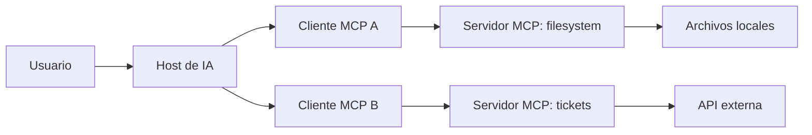

```mermaid
flowchart LR
  Usuario[Usuario] --> Host[Host de IA]
  Host --> ClientA[Cliente MCP A]
  Host --> ClientB[Cliente MCP B]
  ClientA --> ServerA[Servidor MCP: filesystem]
  ClientB --> ServerB[Servidor MCP: tickets]
  ServerA --> Files[Archivos locales]
  ServerB --> API[API externa]
```