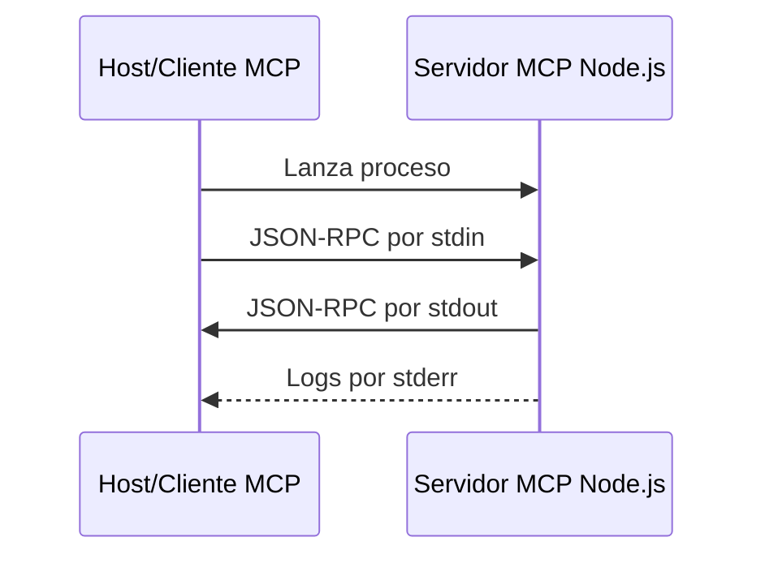

```mermaid
sequenceDiagram
    participant Host as Host/Cliente MCP
    participant Server as Servidor MCP Node.js
    Host->>Server: Lanza proceso
    Host->>Server: JSON-RPC por stdin
    Server->>Host: JSON-RPC por stdout
    Server-->>Host: Logs por stderr
```