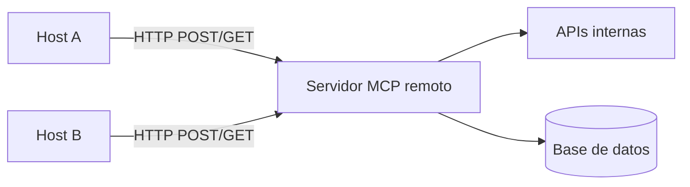

```mermaid
flowchart LR
    HostA[Host A] -->|HTTP POST/GET| MCPHTTP[Servidor MCP remoto]
    HostB[Host B] -->|HTTP POST/GET| MCPHTTP
    MCPHTTP --> API[APIs internas]
    MCPHTTP --> DB[(Base de datos)]
```