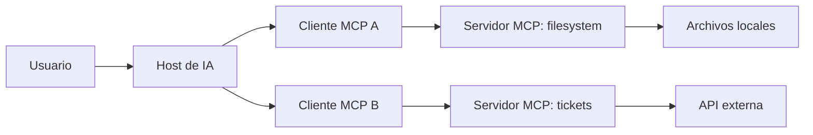
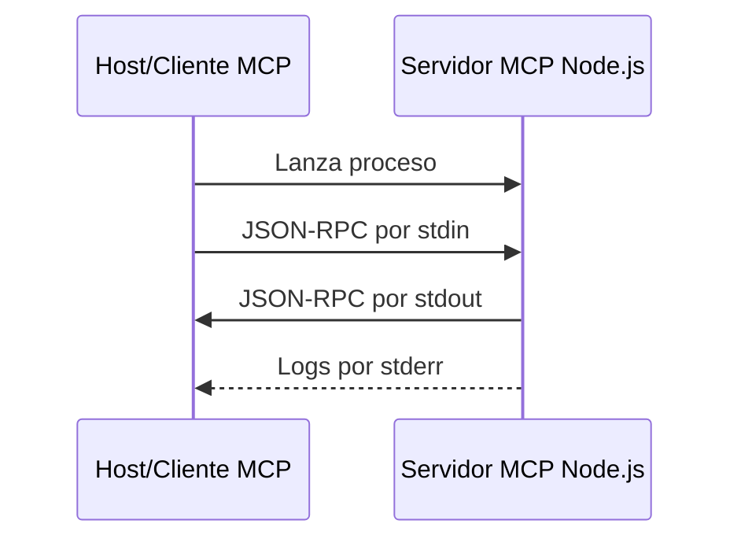
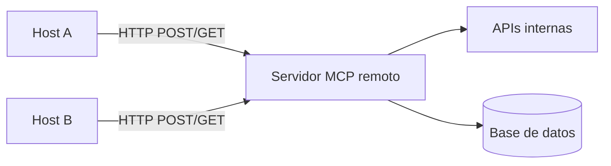

# Curso básico de Model Context Protocol (MCP) para desarrolladores JavaScript/Node.js

**Guía del alumno**  
**Duración:** 2 horas  
**Perfil objetivo:** desarrolladores, principalmente FrontEnd, familiarizados con JavaScript y Node.js.  
**Versión del documento:** 1.0  
**Fecha de actualización:** 2026-06-10  
**Especificación MCP de referencia:** 2025-11-25

---

## 1. Presentación del curso

Model Context Protocol, o MCP, es un protocolo abierto que permite conectar aplicaciones de IA con datos, herramientas y sistemas externos de forma estandarizada. En vez de copiar manualmente grandes bloques de contexto en un chat o crear integraciones ad hoc para cada asistente, MCP define una manera común de exponer capacidades a clientes compatibles.

En desarrollo de software, MCP permite extender la asistencia de IA a distintas fases del ciclo de vida: análisis de requisitos, consulta de documentación, acceso a diseños UX, revisión de código, generación de pruebas, interacción con repositorios, consulta de tickets y automatización de tareas internas.

Este curso se centra en el uso práctico de MCP desde el punto de vista de un desarrollador JavaScript/Node.js. Al terminar, deberías entender cómo consumir servidores MCP existentes, cómo inspeccionar sus capacidades y cómo crear un servidor MCP básico propio.

---

## 2. Objetivo general

Proporcionar a desarrolladores JavaScript/Node.js una comprensión práctica de Model Context Protocol (MCP) para consumir servidores existentes, entender qué capacidades exponen y construir un servidor MCP básico propio.

Al finalizar, los asistentes sabrán:

- Dónde encaja MCP dentro del stack de IA para desarrollo.
- Qué son un host, un cliente MCP y un servidor MCP.
- Cuándo usar `tools`, `resources` y `prompts`.
- Cómo configurar y probar un MCP local.
- Cómo usar MCP Inspector para inspección y depuración.
- Cómo implementar una `tool` con TypeScript/Node.js.
- Qué diferencias hay entre los transportes `stdio` y `Streamable HTTP`.
- Qué criterios básicos de seguridad, validación y operación hay que aplicar antes de integrar MCP en flujos reales.

---

## 3. Contenidos

1. **Dónde encaja MCP en el stack de IA para desarrollo**  
   Host, cliente, servidor MCP, tools, resources y prompts.

2. **Consumo de MCPs existentes**  
   Configuración, permisos, ejemplos habituales y prueba con MCP Inspector.

3. **Creación de un MCP propio con Node.js/TypeScript**  
   Declaración de servidor, tool, schema de entrada, validación, respuesta, errores y logs.

4. **Transportes MCP: stdio vs Streamable HTTP**  
   Cuándo usar cada uno, implicaciones de despliegue, autenticación y debugging.

5. **Seguridad y operación básica**  
   Secretos, permisos, logs, límites y aprobación de acciones.

---

## 4. Agenda recomendada para 2 horas

| Bloque | Duración | Contenido | Resultado esperado |
|---|---:|---|---|
| 1 | 20 min | Encaje de MCP en IA para desarrollo | Entender arquitectura y primitivas básicas |
| 2 | 25 min | Consumo de servidores MCP existentes | Saber configurar un servidor local e inspeccionarlo |
| 3 | 45 min | Creación de un MCP propio con Node.js/TypeScript | Construir una tool funcional y probarla |
| 4 | 15 min | Transportes: stdio y Streamable HTTP | Saber elegir transporte según caso de uso |
| 5 | 15 min | Seguridad, operación y cierre | Aplicar checklist de integración segura |

---

## 5. Requisitos previos

Para aprovechar el curso conviene disponer de:

- Conocimientos básicos de JavaScript moderno.
- Experiencia mínima con Node.js y npm.
- Conocimientos básicos de TypeScript.
- Familiaridad con JSON.
- Una terminal disponible.
- Node.js LTS instalado.
- Un editor de código, por ejemplo Visual Studio Code.

Opcionalmente, para probar integraciones reales, puede usarse un cliente compatible con MCP, como Claude Desktop, VS Code u otro cliente MCP. Durante el curso se usará MCP Inspector como herramienta de prueba, por lo que no es obligatorio depender de un único cliente final.

---

# Bloque 1. Dónde encaja MCP en el stack de IA para desarrollo

## 1.1. Problema que resuelve MCP

Cuando usamos IA para desarrollo, aparecen problemas frecuentes:

- El asistente no tiene acceso directo al contexto real del proyecto.
- El usuario copia y pega archivos, tickets, documentación o errores manualmente.
- Cada herramienta tiene una integración distinta.
- El modelo puede necesitar muchas iteraciones para obtener información suficiente.
- No siempre queda claro qué acciones ha ejecutado la IA y con qué permisos.

MCP busca resolver estos problemas mediante un protocolo común para conectar aplicaciones de IA con herramientas y fuentes de contexto externas.

Ejemplos de contexto o herramientas que podrían exponerse mediante MCP:

- Archivos de un proyecto.
- Documentación interna.
- Tickets de Jira, GitHub Issues o GitLab Issues.
- Repositorios de código.
- Bases de datos.
- Diseños de Figma.
- Sistemas de CI/CD.
- APIs internas.
- Generadores de pruebas.
- Catálogos de componentes UI.

## 1.2. Arquitectura básica

MCP sigue una arquitectura cliente-servidor.



### Host

El **host** es la aplicación de IA que usa el usuario. Puede ser un IDE, una aplicación de escritorio, una interfaz de chat o una herramienta de agente.

Ejemplos de host:

- Un IDE con capacidades de IA.
- Claude Desktop.
- Un cliente personalizado creado por una empresa.
- Una herramienta interna de automatización con LLM.

El host coordina la conversación con el modelo y decide qué servidores MCP están disponibles.

### Cliente MCP

El **cliente MCP** es el componente que mantiene una conexión con un servidor MCP concreto. Normalmente vive dentro del host.

Si un host se conecta a tres servidores MCP, normalmente tendrá tres clientes MCP, uno por servidor.

Responsabilidades habituales del cliente MCP:

- Inicializar la conexión.
- Descubrir capacidades del servidor.
- Listar tools, resources y prompts.
- Invocar tools.
- Leer resources.
- Recuperar prompts.
- Gestionar errores y logs.
- Aplicar confirmaciones de usuario cuando proceda.

### Servidor MCP

El **servidor MCP** es el programa o servicio que expone capacidades al cliente.

Puede ejecutarse:

- Localmente, como un proceso iniciado por el cliente.
- Remotamente, como un servicio HTTP desplegado en una infraestructura compartida.

Un servidor MCP no es necesariamente un servidor web. Un servidor local sobre `stdio` puede ser simplemente un proceso Node.js que lee mensajes por `stdin` y responde por `stdout`.

## 1.3. Capas del protocolo

MCP puede entenderse en dos capas:

### Capa de datos

Define los mensajes y operaciones basados en JSON-RPC 2.0. Aquí aparecen conceptos como:

- Inicialización.
- Capacidades.
- Requests.
- Responses.
- Notifications.
- Tools.
- Resources.
- Prompts.

### Capa de transporte

Define cómo viajan esos mensajes entre cliente y servidor. Los transportes estándar actuales son:

- `stdio`.
- `Streamable HTTP`.

Esto es importante: MCP no es simplemente una API REST. Puede usar HTTP, pero sus mensajes siguen el modelo JSON-RPC definido por MCP.

---

## 1.4. Primitivas principales: tools, resources y prompts

MCP define varias primitivas. En este curso nos centraremos en las tres más importantes para empezar.

### Tools

Las **tools** son funciones que el modelo puede solicitar ejecutar, normalmente con aprobación o supervisión del usuario.

Ejemplos:

```text
search_tickets(projectKey, status)
create_branch(issueId)
get_component_docs(componentName)
run_unit_tests(packageName)
query_database(sql)
```

Usa una tool cuando haya una acción, cálculo, búsqueda o interacción con un sistema externo.

Características clave:

- Tienen nombre único.
- Tienen descripción.
- Declaran un schema de entrada.
- Pueden devolver texto, contenido estructurado, imágenes, audio o referencias a resources.
- Pueden fallar de forma recuperable usando `isError: true`.

### Resources

Los **resources** son datos o documentos que el cliente puede leer para aportar contexto al modelo.

Ejemplos:

```text
file:///project/README.md
docs://frontend/design-system
schema://database/public
figma://component/Button
```

Usa un resource cuando quieras exponer información consultable sin que su lectura implique una acción pesada o peligrosa.

Características clave:

- Se identifican mediante una URI.
- Pueden representar texto o datos binarios.
- Pueden estar parametrizados mediante plantillas de URI.
- Son útiles para documentación, configuración, esquemas, catálogos y archivos.

### Prompts

Los **prompts** son plantillas reutilizables de mensajes que el servidor pone a disposición del cliente o del usuario.

Ejemplos:

```text
review_code(code)
generate_test_plan(userStory)
summarize_incident(logs)
create_accessibility_report(componentName)
```

Usa un prompt cuando quieras estandarizar una interacción con el modelo.

Características clave:

- Son normalmente seleccionados por el usuario.
- Pueden aceptar argumentos.
- Devuelven una secuencia de mensajes preparada para el modelo.
- Ayudan a homogeneizar prácticas dentro de un equipo.

---

## 1.5. Matriz de decisión rápida

| Necesidad | Primitiva recomendada | Ejemplo |
|---|---|---|
| Ejecutar una acción | Tool | Crear una rama, consultar una API, lanzar tests |
| Leer contexto | Resource | README, schema de base de datos, documentación UX |
| Estandarizar una instrucción | Prompt | Revisión de código, generación de plan de pruebas |
| Devolver un resultado grande | Resource o resource_link | Resultado de análisis, archivo generado |
| Pedir confirmación antes de modificar algo | Tool con aprobación del cliente | Borrar archivo, crear issue, desplegar |

---

## 1.6. Ejemplos en el ciclo de desarrollo

### Análisis de requisitos

- Consultar tickets activos.
- Extraer criterios de aceptación.
- Generar preguntas para Product Owner.
- Relacionar historias con documentación funcional.

### Diseño UX/UI

- Consultar componentes de diseño.
- Acceder a tokens de diseño.
- Comparar una historia de usuario con pantallas existentes.
- Generar checklist de accesibilidad.

### Desarrollo

- Consultar documentación interna.
- Localizar componentes existentes.
- Revisar convenciones de código.
- Generar scaffolding.
- Consultar dependencias o scripts del proyecto.

### Testing

- Generar casos de prueba.
- Ejecutar tests unitarios o funcionales.
- Consultar reportes de cobertura.
- Resumir fallos de CI.

### Operación

- Consultar logs.
- Revisar incidencias.
- Generar resúmenes postmortem.
- Automatizar tareas repetitivas con control humano.

---

# Bloque 2. Consumo de MCPs existentes

## 2.1. Qué significa consumir un MCP existente

Consumir un MCP existente significa conectar un host compatible con MCP a un servidor ya implementado.

El flujo habitual es:

1. Elegir un servidor MCP.
2. Revisar qué permisos necesita.
3. Añadirlo a la configuración del cliente/host.
4. Arrancar o reiniciar el host.
5. Inspeccionar qué tools, resources o prompts expone.
6. Probar una operación sencilla.
7. Revisar logs y errores.

## 2.2. Ejemplos habituales de servidores MCP

Categorías frecuentes:

- **Filesystem:** lectura y escritura controlada de carpetas locales.
- **Git/GitHub/GitLab:** consulta de issues, pull requests, ramas o commits.
- **Base de datos:** consulta de esquemas o ejecución controlada de queries.
- **Documentación:** Confluence, Notion, documentación interna o Markdown local.
- **Diseño:** Figma u otras herramientas UX.
- **Navegador:** automatización o extracción controlada de páginas.
- **Testing:** lanzamiento de tests, consulta de reportes o generación de planes.
- **Herramientas internas:** APIs específicas del cliente o del proyecto.

## 2.3. Configuración típica de un servidor local

Muchos servidores locales se configuran mediante un bloque JSON similar a este:

```json
{
  "mcpServers": {
    "filesystem": {
      "command": "npx",
      "args": [
        "-y",
        "@modelcontextprotocol/server-filesystem",
        "/ruta/absoluta/a/carpeta-permitida"
      ]
    }
  }
}
```

Lectura del ejemplo:

- `filesystem`: nombre lógico del servidor dentro del host.
- `command`: comando que ejecutará el servidor.
- `args`: argumentos que se pasan al comando.
- `@modelcontextprotocol/server-filesystem`: paquete npm del servidor.
- `/ruta/absoluta/a/carpeta-permitida`: carpeta a la que se da acceso.

Regla práctica: usa rutas absolutas, no relativas.

## 2.4. Laboratorio 1: probar un servidor filesystem con MCP Inspector

> Objetivo: inspeccionar un servidor MCP existente sin depender de un cliente final concreto.

### Paso 1. Crear una carpeta segura para pruebas

macOS/Linux:

```bash
mkdir -p ~/mcp-course-sandbox
echo "Hola MCP" > ~/mcp-course-sandbox/nota.txt
```

Windows PowerShell:

```powershell
mkdir $HOME\mcp-course-sandbox
"Hola MCP" | Out-File $HOME\mcp-course-sandbox\nota.txt
```

No uses como carpeta permitida tu directorio completo de usuario, la raíz del sistema ni carpetas con información sensible.

### Paso 2. Ejecutar el servidor con MCP Inspector

macOS/Linux:

```bash
npx -y @modelcontextprotocol/inspector npx -y @modelcontextprotocol/server-filesystem ~/mcp-course-sandbox
```

Windows PowerShell:

```powershell
npx -y @modelcontextprotocol/inspector npx -y @modelcontextprotocol/server-filesystem $HOME\mcp-course-sandbox
```

### Paso 3. Inspeccionar capacidades

En MCP Inspector revisa:

- Tools disponibles.
- Descripciones de cada tool.
- Schemas de entrada.
- Resources disponibles, si existen.
- Logs y errores.
- Resultado de invocar una tool sencilla.

### Paso 4. Ejecutar una prueba segura

Ejemplos de acciones adecuadas para una carpeta sandbox:

- Listar archivos.
- Leer `nota.txt`.
- Crear un archivo temporal.
- Renombrar un archivo temporal.

Evita probar acciones destructivas fuera de una carpeta de práctica.

## 2.5. Permisos y aprobaciones

Aunque un servidor MCP exponga una tool, el host o cliente puede pedir aprobación al usuario antes de ejecutarla. Esto es especialmente importante en tools que:

- Leen archivos.
- Modifican archivos.
- Escriben en sistemas externos.
- Ejecutan comandos.
- Consultan datos sensibles.
- Hacen cambios en tickets, repositorios o despliegues.

La aprobación humana no sustituye al diseño seguro del servidor. Deben aplicarse ambas capas:

1. El servidor limita lo que puede hacer.
2. El cliente muestra y solicita confirmación cuando la acción es sensible.

## 2.6. Errores habituales al consumir MCPs existentes

| Error | Síntoma | Solución |
|---|---|---|
| Ruta relativa | El servidor no encuentra archivos | Usar ruta absoluta |
| Falta Node.js/npm | `npx` no existe o falla | Instalar Node.js LTS |
| Permisos insuficientes | La tool falla al leer/escribir | Revisar permisos del sistema operativo |
| Configuración JSON inválida | El servidor no aparece | Validar JSON |
| Variables de entorno ausentes | Falla la autenticación | Añadir `env` en la configuración |
| Logs en stdout | El protocolo se rompe | Usar stderr para logs en stdio |
| Carpeta demasiado amplia | Riesgo de exposición de datos | Limitar a carpeta sandbox o de proyecto |

---

# Bloque 3. Creación de un MCP propio con Node.js/TypeScript

## 3.1. Qué vamos a construir

Construiremos un servidor MCP local que expone una tool llamada:

```text
get_project_status
```

La tool recibirá:

- `projectId`: identificador del proyecto.
- `includeRisks`: booleano opcional para incluir riesgos.

Y devolverá:

- Estado del proyecto.
- Porcentaje de avance.
- Próximo hito.
- Riesgos, si se solicitan.

También añadiremos ejemplos opcionales de:

- Un resource con documentación de estándares FrontEnd.
- Un prompt para revisar historias de usuario.

## 3.2. Estructura del proyecto

```text
mcp-course-server/
  package.json
  tsconfig.json
  src/
    index.ts
```

## 3.3. Crear el proyecto

```bash
mkdir mcp-course-server
cd mcp-course-server
npm init -y
npm install @modelcontextprotocol/sdk zod@3
npm install -D typescript @types/node
mkdir src
```

## 3.4. Configurar TypeScript

Crea `tsconfig.json`:

```json
{
  "compilerOptions": {
    "target": "ES2022",
    "module": "NodeNext",
    "moduleResolution": "NodeNext",
    "outDir": "./build",
    "rootDir": "./src",
    "strict": true,
    "esModuleInterop": true,
    "skipLibCheck": true,
    "forceConsistentCasingInFileNames": true
  },
  "include": ["src/**/*"],
  "exclude": ["node_modules"]
}
```

## 3.5. Configurar package.json

Ajusta `package.json` para trabajar con módulos ES y compilar el proyecto:

```json
{
  "type": "module",
  "scripts": {
    "build": "tsc",
    "start": "node build/index.js",
    "inspect": "npx -y @modelcontextprotocol/inspector node build/index.js"
  },
  "dependencies": {
    "@modelcontextprotocol/sdk": "latest",
    "zod": "^3.23.8"
  },
  "devDependencies": {
    "@types/node": "latest",
    "typescript": "latest"
  }
}
```

Nota: si tu `package.json` ya contiene otros campos, conserva los necesarios y añade `type` y `scripts`.

## 3.6. Implementar el servidor MCP

Crea `src/index.ts`:

```ts
import { McpServer } from "@modelcontextprotocol/sdk/server/mcp.js";
import { StdioServerTransport } from "@modelcontextprotocol/sdk/server/stdio.js";
import { z } from "zod";

type ProjectStatus = {
  projectId: string;
  name: string;
  status: "green" | "yellow" | "red";
  progress: number;
  nextMilestone: string;
  risks: string[];
};

const projects: Record<string, ProjectStatus> = {
  "web-shop": {
    projectId: "web-shop",
    name: "Web Shop FrontEnd",
    status: "yellow",
    progress: 68,
    nextMilestone: "Integración de checkout con pasarela de pagos",
    risks: [
      "Dependencia pendiente del equipo de backend",
      "Faltan pruebas E2E para el flujo de compra"
    ]
  },
  "design-system": {
    projectId: "design-system",
    name: "Design System Corporativo",
    status: "green",
    progress: 82,
    nextMilestone: "Publicación de componentes Button, Modal y Tabs",
    risks: [
      "Alinear tokens de color con UX antes de la publicación"
    ]
  }
};

const server = new McpServer({
  name: "mcp-course-projects",
  version: "1.0.0"
});

server.registerTool(
  "get_project_status",
  {
    title: "Consultar estado de proyecto",
    description:
      "Devuelve un resumen del estado de un proyecto interno a partir de su identificador.",
    inputSchema: {
      projectId: z
        .string()
        .min(2)
        .max(30)
        .describe("Identificador del proyecto. Ejemplos: web-shop, design-system"),
      includeRisks: z
        .boolean()
        .optional()
        .default(false)
        .describe("Indica si deben incluirse los riesgos conocidos del proyecto")
    },
    outputSchema: {
      projectId: z.string(),
      name: z.string(),
      status: z.string(),
      progress: z.number(),
      nextMilestone: z.string(),
      risks: z.array(z.string()).optional()
    }
  },
  async ({ projectId, includeRisks }) => {
    console.error(
      `[get_project_status] projectId=${projectId}, includeRisks=${includeRisks}`
    );

    const project = projects[projectId];

    if (!project) {
      return {
        isError: true,
        content: [
          {
            type: "text",
            text:
              `No existe el proyecto '${projectId}'. ` +
              `Prueba con uno de estos identificadores: ${Object.keys(projects).join(", ")}.`
          }
        ]
      };
    }

    const output = {
      projectId: project.projectId,
      name: project.name,
      status: project.status,
      progress: project.progress,
      nextMilestone: project.nextMilestone,
      ...(includeRisks ? { risks: project.risks } : {})
    };

    const riskText =
      includeRisks && project.risks.length > 0
        ? `\nRiesgos:\n- ${project.risks.join("\n- ")}`
        : "";

    return {
      content: [
        {
          type: "text",
          text:
            `Proyecto: ${project.name}\n` +
            `Estado: ${project.status}\n` +
            `Avance: ${project.progress}%\n` +
            `Próximo hito: ${project.nextMilestone}` +
            riskText
        }
      ],
      structuredContent: output
    };
  }
);

server.registerResource(
  "frontend-standards",
  "docs://frontend/standards",
  {
    title: "Estándares FrontEnd",
    description: "Guía breve de convenciones FrontEnd del proyecto",
    mimeType: "text/markdown"
  },
  async (uri) => ({
    contents: [
      {
        uri: uri.href,
        mimeType: "text/markdown",
        text: `# Estándares FrontEnd

- Usar TypeScript en modo strict.
- Mantener componentes pequeños y componibles.
- Cubrir lógica crítica con tests unitarios.
- Revisar accesibilidad básica: etiquetas, foco y contraste.
- Evitar acoplar componentes UI a llamadas HTTP directas.
`
      }
    ]
  })
);

server.registerPrompt(
  "review_user_story",
  {
    title: "Revisar historia de usuario",
    description:
      "Genera una revisión técnica de una historia de usuario antes de empezar el desarrollo.",
    argsSchema: {
      story: z.string().min(20).describe("Historia de usuario completa"),
      frontendStack: z
        .string()
        .optional()
        .describe("Stack FrontEnd. Ejemplo: React, Angular, Vue")
    }
  },
  ({ story, frontendStack }) => ({
    messages: [
      {
        role: "user",
        content: {
          type: "text",
          text:
            `Revisa la siguiente historia de usuario desde el punto de vista de desarrollo FrontEnd.\n\n` +
            `Stack: ${frontendStack ?? "no especificado"}\n\n` +
            `Historia:\n${story}\n\n` +
            `Devuelve:\n` +
            `1. Dudas funcionales.\n` +
            `2. Riesgos técnicos.\n` +
            `3. Criterios de aceptación mejorados.\n` +
            `4. Casos de prueba sugeridos.`
        }
      }
    ]
  })
);

const transport = new StdioServerTransport();
await server.connect(transport);
```

## 3.7. Compilar

```bash
npm run build
```

Si hay errores de TypeScript:

- Revisa imports.
- Revisa versión de TypeScript.
- Revisa que `type` sea `module`.
- Revisa que `module` y `moduleResolution` sean compatibles.

## 3.8. Probar con MCP Inspector

```bash
npm run inspect
```

En MCP Inspector:

1. Comprueba que aparece el servidor.
2. Abre la sección de tools.
3. Busca `get_project_status`.
4. Ejecuta la tool con este input:

```json
{
  "projectId": "web-shop",
  "includeRisks": true
}
```

5. Ejecuta una prueba de error:

```json
{
  "projectId": "unknown-project",
  "includeRisks": true
}
```

6. Revisa si el error devuelto es útil para que el modelo pueda corregirse.

## 3.9. Conectar el servidor a un cliente MCP local

Una configuración genérica para un cliente que soporte servidores locales por `stdio` podría ser:

```json
{
  "mcpServers": {
    "course-projects": {
      "command": "node",
      "args": [
        "/ruta/absoluta/a/mcp-course-server/build/index.js"
      ],
      "env": {
        "NODE_ENV": "production"
      }
    }
  }
}
```

Puntos importantes:

- Usa una ruta absoluta a `build/index.js`.
- No incluyas secretos en repositorios.
- Reinicia el cliente tras cambiar la configuración.
- Revisa los logs del cliente si el servidor no aparece.

---

## 3.10. Anatomía de una tool MCP

Una tool bien diseñada debe responder a estas preguntas:

### 1. Qué hace

La descripción debe ser clara. El modelo usará esa descripción para decidir cuándo invocar la tool.

Mala descripción:

```text
Hace cosas de proyecto.
```

Mejor descripción:

```text
Devuelve un resumen del estado de un proyecto interno a partir de su identificador.
```

### 2. Qué datos necesita

Los argumentos deben estar tipados y validados.

Ejemplo:

```ts
inputSchema: {
  projectId: z.string().min(2).max(30),
  includeRisks: z.boolean().optional().default(false)
}
```

### 3. Qué devuelve

El resultado puede incluir:

- `content`: contenido visible para el modelo/usuario.
- `structuredContent`: JSON estructurado para clientes o flujos que lo necesiten.
- `isError`: marca de error recuperable.

### 4. Qué errores pueden ocurrir

Un error recuperable debe ayudar al modelo a corregirse.

Ejemplo:

```ts
return {
  isError: true,
  content: [
    {
      type: "text",
      text: "No existe el proyecto 'x'. Prueba con: web-shop, design-system."
    }
  ]
};
```

### 5. Qué permisos necesita

Antes de crear una tool, pregúntate:

- ¿Lee datos sensibles?
- ¿Escribe en sistemas externos?
- ¿Puede borrar o modificar información?
- ¿Debe requerir aprobación humana?
- ¿Debe limitarse por rol, proyecto o entorno?

---

## 3.11. Buenas prácticas para diseñar tools

| Práctica | Motivo |
|---|---|
| Nombres claros y específicos | El modelo decide mejor cuándo usarlas |
| Schemas estrictos | Reducen llamadas inválidas |
| Descripciones orientadas a uso | Mejoran la selección automática |
| Resultados breves y estructurados | Reducen ruido y facilitan procesamiento |
| Errores accionables | Permiten autocorrección |
| Idempotencia cuando sea posible | Evita efectos duplicados |
| Timeouts | Evitan bloqueos |
| Rate limits | Protegen APIs internas |
| Auditoría | Permite trazabilidad |
| Aprobación en acciones sensibles | Reduce riesgo operativo |

---

## 3.12. Ejercicios del bloque 3

### Ejercicio 1. Añadir una tool de listado

Crear una tool llamada:

```text
list_projects
```

Debe devolver los proyectos disponibles.

Input recomendado:

```ts
inputSchema: {
  onlyWithRisks: z.boolean().optional().default(false)
}
```

### Ejercicio 2. Añadir validación de formato

Modificar `projectId` para aceptar solo letras minúsculas, números y guiones.

Pista:

```ts
z.string().regex(/^[a-z0-9-]+$/)
```

### Ejercicio 3. Añadir un error de negocio

Si el proyecto está en estado `red`, devolver un mensaje que recomiende revisar riesgos antes de continuar.

### Ejercicio 4. Añadir una variable de entorno

Añadir una variable:

```text
MCP_COURSE_ALLOW_RISKS=true
```

Si no está activa, la tool no debe devolver riesgos aunque `includeRisks` sea `true`.

---

# Bloque 4. Transportes MCP: stdio vs Streamable HTTP

## 4.1. Qué es un transporte

El transporte es el mecanismo por el que viajan los mensajes MCP entre cliente y servidor.

MCP define mensajes JSON-RPC. El transporte responde a la pregunta: ¿por dónde se envían esos mensajes?

Transportes estándar actuales:

- `stdio`.
- `Streamable HTTP`.

## 4.2. stdio

`stdio` usa la entrada y salida estándar del proceso.

Funcionamiento general:

1. El cliente lanza el servidor como subproceso.
2. El cliente escribe mensajes MCP en `stdin` del servidor.
3. El servidor responde por `stdout`.
4. Los logs deben ir a `stderr`, no a `stdout`.



### Cuándo usar stdio

Usa `stdio` cuando:

- El servidor es local.
- El cliente puede lanzar procesos.
- La integración es para un usuario o entorno local.
- Quieres simplicidad.
- No necesitas compartir el mismo servidor entre muchos usuarios.

Ejemplos:

- Acceso a archivos locales.
- Scripts internos de desarrollo.
- Integraciones con herramientas de CLI.
- Servidores MCP para un IDE.

### Ventajas

- Fácil de implementar.
- No necesita exponer puertos HTTP.
- Buena opción para desarrollo local.
- Menor superficie de red.

### Limitaciones

- Pensado principalmente para ejecución local.
- Normalmente sirve a un único cliente por proceso.
- No es ideal para despliegues compartidos.
- Logging incorrecto en `stdout` rompe el protocolo.

## 4.3. Streamable HTTP

`Streamable HTTP` usa HTTP como transporte para mensajes MCP.

Características:

- El servidor se ejecuta como proceso o servicio independiente.
- Puede atender múltiples clientes.
- Usa un endpoint MCP único.
- Usa HTTP `POST` para enviar mensajes JSON-RPC.
- Puede usar HTTP `GET` y SSE para mensajes servidor-cliente.
- Puede manejar sesiones y reanudación según implementación.



### Cuándo usar Streamable HTTP

Usa `Streamable HTTP` cuando:

- Necesitas un servidor remoto.
- Varias personas o clientes consumirán el mismo MCP.
- Quieres desplegar en infraestructura cloud.
- Necesitas autenticación centralizada.
- Necesitas observabilidad, escalado o control de sesiones.

Ejemplos:

- MCP corporativo para consultar documentación interna.
- MCP remoto para Jira/Confluence.
- MCP para datos de observabilidad.
- MCP para un catálogo de servicios o componentes.

### Ventajas

- Adecuado para servicios compartidos.
- Permite autenticación y control centralizado.
- Encaja mejor con despliegues cloud.
- Puede aprovechar herramientas HTTP de observabilidad.

### Riesgos y requisitos

- Debe implementar autenticación adecuada.
- Debe validar cabeceras como `Origin`.
- Si corre localmente, debe enlazar preferiblemente a `localhost`.
- Debe protegerse contra exposición accidental en red.
- Requiere más trabajo de operación.

## 4.4. Comparativa rápida

| Criterio | stdio | Streamable HTTP |
|---|---|---|
| Caso típico | Local | Remoto o compartido |
| Arranque | Lo lanza el cliente | Servicio independiente |
| Comunicación | stdin/stdout | HTTP POST/GET, opcional SSE |
| Clientes simultáneos | Normalmente uno por proceso | Múltiples clientes |
| Autenticación | Variables de entorno/permisos locales | Auth HTTP/OAuth u otros mecanismos |
| Logs | stderr o fichero | Logs de servidor, HTTP tooling, tracing |
| Complejidad | Baja | Media/alta |
| Riesgo principal | Romper stdout, permisos locales excesivos | Exposición de red, auth, sesiones, CORS/Origin |
| Mejor para | IDE/local dev | Integraciones corporativas compartidas |

## 4.5. No confundir Streamable HTTP con REST

Aunque Streamable HTTP usa HTTP, no es REST clásico.

Diferencias importantes:

- MCP define mensajes JSON-RPC.
- El endpoint HTTP recibe mensajes MCP, no recursos REST independientes.
- No se modelan operaciones como `GET /projects/123` o `POST /tickets` necesariamente.
- El significado lo define el método JSON-RPC, por ejemplo `tools/list`, `tools/call` o `resources/read`.

Forma mental correcta:

```text
HTTP transporta mensajes MCP.
JSON-RPC define la llamada.
La tool o resource define la capacidad funcional.
```

---

# Bloque 5. Seguridad y operación básica

## 5.1. Por qué la seguridad importa en MCP

MCP conecta IA con herramientas reales. Esto significa que un error de diseño puede permitir:

- Exposición de archivos.
- Filtración de secretos.
- Escritura no deseada en sistemas externos.
- Ejecución de acciones peligrosas.
- Uso excesivo de APIs internas.
- Mezcla de datos entre clientes o proyectos.
- Logs con información sensible.

Una integración MCP debe tratarse como una integración de software real, no como un simple prompt.

## 5.2. Principio de mínimo privilegio

Un servidor MCP debe tener solo los permisos necesarios.

Ejemplos:

- Si solo necesita leer documentación, no le des permisos de escritura.
- Si solo necesita una carpeta, no le des acceso al home completo.
- Si solo necesita consultar tickets, no le des permisos de administración.
- Si solo debe trabajar en entorno de desarrollo, no le des credenciales de producción.

## 5.3. Gestión de secretos

No incluyas secretos en:

- Código fuente.
- Prompts.
- Respuestas de tools.
- Logs.
- Archivos de ejemplo versionados.
- Capturas de pantalla.

Usa variables de entorno o gestores de secretos.

Ejemplo de configuración con variable de entorno:

```json
{
  "mcpServers": {
    "tickets": {
      "command": "node",
      "args": ["/ruta/absoluta/tickets-mcp/build/index.js"],
      "env": {
        "TICKETS_API_BASE_URL": "https://tickets.example.internal",
        "TICKETS_API_TOKEN": "valor-inyectado-de-forma-segura"
      }
    }
  }
}
```

En una configuración real, evita guardar el token en claro en un repositorio.

## 5.4. Logs

Reglas básicas:

- En `stdio`, no uses `console.log()` para logs, porque escribe en `stdout`.
- En `stdio`, usa `console.error()` o una librería que escriba en `stderr` o fichero.
- No registres tokens, passwords ni datos personales.
- Incluye contexto técnico útil: tool invocada, duración, resultado, request ID si existe.
- Registra errores con suficiente información para depurar.

Ejemplo:

```ts
console.error(
  JSON.stringify({
    level: "info",
    tool: "get_project_status",
    projectId,
    includeRisks,
    timestamp: new Date().toISOString()
  })
);
```

## 5.5. Límites operativos

Toda tool que interactúe con sistemas reales debería considerar:

- Timeout.
- Rate limit.
- Tamaño máximo de respuesta.
- Número máximo de resultados.
- Reintentos controlados.
- Circuit breaker en APIs inestables.
- Paginación si lista muchos elementos.
- Auditoría de acciones.

Ejemplo de input con límite:

```ts
inputSchema: {
  query: z.string().min(3).max(100),
  limit: z.number().int().min(1).max(20).default(5)
}
```

## 5.6. Aprobación de acciones

Hay acciones que deberían requerir confirmación explícita del usuario en el cliente:

- Borrar archivos.
- Sobrescribir archivos.
- Crear pull requests.
- Fusionar ramas.
- Lanzar despliegues.
- Ejecutar comandos.
- Enviar emails o mensajes.
- Modificar tickets.
- Actualizar datos de negocio.

Diseño recomendado:

1. La tool describe claramente qué hará.
2. El cliente muestra inputs al usuario.
3. El usuario aprueba o deniega.
4. El servidor vuelve a validar permisos.
5. La acción queda auditada.

## 5.7. Checklist de seguridad para una tool MCP

Antes de publicar una tool, revisa:

- [ ] El nombre de la tool es claro y específico.
- [ ] La descripción no induce a usos ambiguos.
- [ ] El input schema valida tipos, rangos y formatos.
- [ ] La tool no acepta strings genéricos peligrosos si puede aceptar parámetros estructurados.
- [ ] Se aplican permisos por usuario, proyecto o entorno.
- [ ] Los secretos no aparecen en respuestas ni logs.
- [ ] Las respuestas se limitan en tamaño.
- [ ] Hay timeouts.
- [ ] Hay control de errores.
- [ ] Los errores son accionables.
- [ ] Las acciones destructivas requieren aprobación.
- [ ] Hay trazabilidad de uso.
- [ ] Se han probado casos de error en MCP Inspector.

## 5.8. Checklist de operación

Antes de integrar un MCP en un flujo de equipo:

- [ ] Está documentado qué tools/resources/prompts expone.
- [ ] Está documentado qué permisos necesita.
- [ ] Está definida la estrategia de logs.
- [ ] Está definida la estrategia de secretos.
- [ ] Se sabe cómo arrancarlo en local.
- [ ] Se sabe cómo probarlo con MCP Inspector.
- [ ] Se sabe dónde consultar logs del cliente.
- [ ] Hay versión del servidor.
- [ ] Hay responsable de mantenimiento.
- [ ] Hay plan de actualización si cambia la especificación o el SDK.

---

# Actividad final: diseñar un MCP para un caso real

En grupos o individualmente, elige un caso de uso de tu proyecto actual y responde:

1. ¿Qué problema resolvería el MCP?
2. ¿Quién sería el host?
3. ¿Qué servidor MCP habría que crear o configurar?
4. ¿Qué tools expondría?
5. ¿Qué resources expondría?
6. ¿Qué prompts serían útiles?
7. ¿Qué transporte usaría: stdio o Streamable HTTP?
8. ¿Qué permisos mínimos necesita?
9. ¿Qué acciones requieren aprobación?
10. ¿Qué logs y métricas se deberían guardar?

Ejemplo de respuesta resumida:

```text
Caso: consulta de tickets funcionales desde el IDE.
Host: IDE con cliente MCP.
Servidor: tickets-mcp.
Transporte: Streamable HTTP, porque lo usarán varios equipos.
Tools:
- search_tickets(projectKey, status, assignee, limit)
- get_ticket(ticketId)
Resources:
- docs://tickets/workflow
Prompts:
- refine_user_story(ticketId)
Permisos:
- lectura de tickets del proyecto asignado.
Aprobación:
- necesaria para modificar estados o crear comentarios.
Logs:
- usuario, ticket, tool, duración, resultado, error.
```

---

# Glosario

**MCP**  
Model Context Protocol. Protocolo para conectar aplicaciones de IA con datos, tools y sistemas externos.

**Host**  
Aplicación de IA que coordina la experiencia del usuario y gestiona clientes MCP.

**Cliente MCP**  
Componente del host que mantiene una conexión con un servidor MCP.

**Servidor MCP**  
Programa o servicio que expone capabilities al cliente MCP.

**Tool**  
Función invocable, normalmente usada por el modelo para realizar acciones, consultas o cálculos.

**Resource**  
Dato o documento consultable por el cliente para proporcionar contexto.

**Prompt**  
Plantilla reutilizable de mensajes para guiar interacciones con el modelo.

**Transport**  
Mecanismo de comunicación entre cliente y servidor MCP.

**stdio**  
Transporte basado en entrada y salida estándar del proceso.

**Streamable HTTP**  
Transporte MCP basado en HTTP POST/GET y opcionalmente SSE.

**JSON-RPC**  
Formato de mensajería usado por MCP para requests, responses y notifications.

**Schema de entrada**  
Definición formal de los parámetros aceptados por una tool.

**MCP Inspector**  
Herramienta interactiva para probar y depurar servidores MCP.

---

# Resumen para recordar

- MCP estandariza cómo una aplicación de IA se conecta a contexto y herramientas externas.
- La arquitectura se compone de host, cliente MCP y servidor MCP.
- Las tres primitivas principales para empezar son `tools`, `resources` y `prompts`.
- Una `tool` ejecuta una acción o consulta.
- Un `resource` expone información consultable.
- Un `prompt` estandariza una interacción con el modelo.
- `stdio` es ideal para servidores locales simples.
- `Streamable HTTP` es mejor para servidores remotos o compartidos.
- Streamable HTTP no debe entenderse como REST clásico: transporta mensajes JSON-RPC de MCP.
- En `stdio`, nunca escribas logs en `stdout`; usa `stderr`.
- MCP Inspector debería ser la primera herramienta para probar y depurar.
- Las tools deben diseñarse con permisos mínimos, validación estricta, límites y errores accionables.
- Las acciones sensibles deben requerir aprobación humana.

---

# Referencias oficiales

- Model Context Protocol - Specification 2025-11-25: https://modelcontextprotocol.io/specification/2025-11-25
- MCP Architecture: https://modelcontextprotocol.io/docs/learn/architecture
- MCP Transports 2025-11-25: https://modelcontextprotocol.io/specification/2025-11-25/basic/transports
- MCP Tools 2025-11-25: https://modelcontextprotocol.io/specification/2025-11-25/server/tools
- MCP Resources 2025-11-25: https://modelcontextprotocol.io/specification/2025-11-25/server/resources
- MCP Prompts 2025-11-25: https://modelcontextprotocol.io/specification/2025-11-25/server/prompts
- MCP TypeScript SDK: https://ts.sdk.modelcontextprotocol.io/documents/server.html
- Build an MCP server: https://modelcontextprotocol.io/docs/develop/build-server
- Connect to local MCP servers: https://modelcontextprotocol.io/docs/develop/connect-local-servers
- MCP Inspector: https://modelcontextprotocol.io/docs/tools/inspector
- MCP Debugging: https://modelcontextprotocol.io/docs/tools/debugging

---

# Anexo A. Plantilla para diseñar una tool MCP

```markdown
## Nombre de la tool

`nombre_tool`

## Objetivo

¿Qué problema resuelve?

## Usuario objetivo

¿Quién la usará?

## Cuándo debe invocarse

Describe escenarios claros de uso.

## Cuándo no debe invocarse

Describe límites y casos excluidos.

## Input schema

- Campo 1:
- Campo 2:
- Campo 3:

## Output esperado

- Texto:
- JSON estructurado:
- Links a resources:

## Errores recuperables

- Error 1:
- Error 2:

## Permisos

- Lectura:
- Escritura:
- Sistemas externos:

## Seguridad

- ¿Contiene datos sensibles?
- ¿Requiere aprobación?
- ¿Tiene rate limit?
- ¿Tiene timeout?

## Observabilidad

- Logs:
- Métricas:
- Auditoría:
```

---

# Anexo B. Plantilla de configuración local

```json
{
  "mcpServers": {
    "nombre-servidor": {
      "command": "node",
      "args": [
        "/ruta/absoluta/al/servidor/build/index.js"
      ],
      "env": {
        "NODE_ENV": "production"
      }
    }
  }
}
```

---

# Anexo C. Comandos útiles

Crear proyecto:

```bash
mkdir mcp-course-server
cd mcp-course-server
npm init -y
npm install @modelcontextprotocol/sdk zod@3
npm install -D typescript @types/node
mkdir src
```

Compilar:

```bash
npm run build
```

Probar con Inspector:

```bash
npx -y @modelcontextprotocol/inspector node build/index.js
```

Probar un servidor filesystem existente:

```bash
npx -y @modelcontextprotocol/inspector npx -y @modelcontextprotocol/server-filesystem ~/mcp-course-sandbox
```

---

# Anexo D. Preguntas de autoevaluación

1. ¿Qué diferencia hay entre host, cliente MCP y servidor MCP?
2. ¿Cuándo usarías una tool en lugar de un resource?
3. ¿Cuándo usarías un prompt?
4. ¿Por qué una tool debe tener un schema de entrada estricto?
5. ¿Por qué no se debe escribir en `stdout` en un servidor MCP con `stdio`?
6. ¿Qué ventajas tiene `stdio` para desarrollo local?
7. ¿Qué ventajas tiene `Streamable HTTP` para entornos corporativos?
8. ¿Por qué Streamable HTTP no debe explicarse como REST clásico?
9. ¿Qué acciones deberían requerir aprobación humana?
10. ¿Qué datos no deberían aparecer nunca en logs?
11. ¿Qué revisarías si un servidor MCP no aparece en el cliente?
12. ¿Para qué sirve MCP Inspector?

---

# Anexo E. Soluciones orientativas de autoevaluación

1. El host es la aplicación de IA; el cliente MCP es el conector dentro del host; el servidor MCP expone capacidades.
2. Usaría una tool para ejecutar una acción o consulta con parámetros; usaría un resource para exponer contexto consultable.
3. Usaría un prompt para estandarizar una interacción repetible con el modelo.
4. Porque ayuda al modelo a invocar correctamente la tool y reduce errores o inputs peligrosos.
5. Porque `stdout` transporta mensajes JSON-RPC; cualquier log en `stdout` puede romper el protocolo.
6. Simplicidad, menor exposición de red y ejecución como proceso local.
7. Permite servidores compartidos, autenticación centralizada, despliegue remoto y observabilidad HTTP.
8. Porque usa HTTP como transporte, pero las operaciones son mensajes MCP/JSON-RPC, no recursos REST clásicos.
9. Borrado, escritura, despliegues, ejecución de comandos, modificación de tickets, envíos externos y acciones irreversibles.
10. Tokens, passwords, datos personales, información confidencial y respuestas completas con datos sensibles.
11. Configuración JSON, rutas absolutas, comando, permisos, variables de entorno, build y logs del cliente.
12. Sirve para probar y depurar servidores MCP, inspeccionar tools/resources/prompts y ejecutar llamadas controladas.
